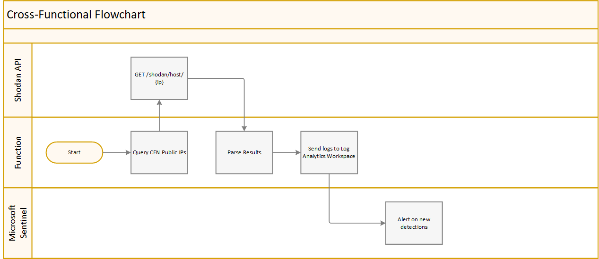

# MicrosoftSentinel-ShodanMonitor

## Description
Network perimeter forms the first strategic point of attack where a threat actor checks for weaknesses in security posture. 
This tool forms the basis of identifying changes made to our assets as well as new services being exposed to public. This would increase our response time in case of unapproved or incorrect changes being implemented.

Since we dont have an existing shodan subscription to leverage the [shodan servcies](https://www.shodan.io/) we make use of the API to traverse over our public IPs and find the services/ports that might be left open unintentionally. This would act as a tool for:
* Identifying public facing assets
* Detecting when changes are made to public servers.

## Assumptions
* Public IPs are known
* Access to scanning service is established

## Workflow
1. A list of all public network domains is pulled from the azure storage client.
2. Process each network range using the shodan search query via net filter.
3. A list of properties is provided which filters the results and stores them for each IP within the sub domains.
```python
field = ['ip_str', 'org', 'os', 'device', 'devicetype', 'product','asn',
'port','location','isp','transport','domains','hostnames','timestamp']
```
4. These results are then sent to log analytics workspace.
5. A kql query is used to showcase changes in services/ports.

## Configuration

* After deploying the resources using the ARM template below, upload your list of IPs to monitor to the resulting file share "shodanmonitor" to a file named `ipv4_ranges.csv`

## Design


## Deploy to Azure
Use the following buttons to deploy the Azure resources:

[](https://portal.azure.com/#create/Microsoft.Template/uri/https%3A%2F%2Fraw%2Egithubusercontent%2Ecom%2Faishakothare31%2FMicrosoftSentinel%2DShodanMonitor%2Fmaster%2Fazure%2Ddeploy%2Ejson)

[](https://portal.azure.com/#create/Microsoft.Template/uri/https%3A%2F%2Fraw%2Egithubusercontent%2Ecom%2Faishakothare31%2FMicrosoftSentinel%2DShodanMonitor%2Fmaster%2Fazure%2Ddeploy%2Ejson)

The template deploys the following:

* Creates and configures an Azure Function app, including App Insights
* Creates a storage account
* Creates a key vault to store secrets